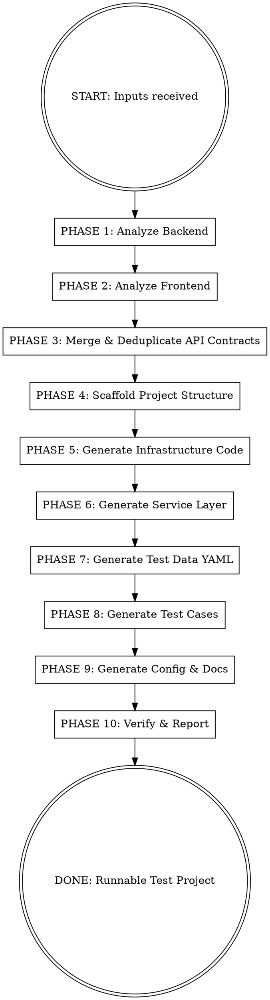

# AutoTestProjectBuilder

## Overview

Automatically analyze any frontend/backend project and generate a complete, runnable test automation project following the **factory-hold-test standard architecture**. Zero manual coding required — static code analysis drives everything from project structure to test case generation.

**Core principle:** One command in, one complete test project out. Ready to run, ready for CI/CD.

## When to Use

- User provides frontend path + backend path + target test project name
- User says "help me build a test project for [system]"
- User has a new microservice and needs test automation scaffolding

## Required Inputs

Before starting, confirm you have all three:
1. **Backend project path** (Java/Spring Boot preferred; also supports Node.js, Python)
2. **Frontend project path** (Vue/React; or Postman collection as substitute)
3. **Target test project name** (e.g., `wms-shipping-test`)

If any input is missing, ask for it before proceeding.

---

## Execution Flow



---

## PHASE 1 — Analyze Backend

**Goal:** Extract complete API contracts from backend source code.

**Steps:**
1. Use `Glob` to find all relevant files:
   - `**/*Controller.java` — REST endpoints
   - `**/*FeignClient.java` — internal service calls
   - `**/*DTO.java`, `**/*Cmd.java`, `**/*Qry.java` — request objects
   - `**/*VO.java`, `**/*Response.java` — response objects
   - `**/*Enum.java` — valid enum values
   - `**/application*.yml`, `**/bootstrap*.yml` — service name, context-path
   - `**/*Mapper.xml` — table/field mappings (for DB assertion setup)

2. For each Controller/FeignClient, extract:
   - HTTP method + URL path
   - Request body fields (name, type, required/optional, validation annotations)
   - Response structure
   - Authentication requirements (`@PreAuthorize`, security configs)

3. For each DTO/Cmd/Qry, extract:
   - All fields with `@NotNull`, `@NotBlank`, `@NotEmpty`, `@Size`, `@Min/@Max` constraints
   - `@Valid` chained validations
   - Enum-typed fields (→ cross-reference Enum classes for valid values)

4. Build **API Inventory Table**:

   | Module | Endpoint | Method | Required Fields | Optional Fields | Auth |
   |--------|----------|--------|----------------|-----------------|------|

**Output:** `analysis/backend_api_inventory.md`

---

## PHASE 2 — Analyze Frontend

**Goal:** Supplement backend analysis with frontend-visible business rules.

**Steps:**
1. Use `Glob` to find:
   - `**/*.vue`, `**/*.tsx`, `**/*.jsx` — form components
   - `**/api/*.js`, `**/api/*.ts` — frontend API call definitions
   - `**/constants/*.js` — frontend enums/constants

2. For each form component, extract:
   - `v-model` or controlled field names
   - `:required`, `required: true` rules
   - `v-if` / conditional field display logic
   - Frontend-only validation rules (regex, length, format)

3. Cross-reference frontend API calls with backend endpoints:
   - Match URL paths
   - Identify fields the frontend sends that backend DTOs accept

**Fallback:** If no frontend path provided, use Postman collection or API docs as substitute.

**Output:** Supplement API Inventory with frontend-only required fields column.

---

## PHASE 3 — Merge & Build API Contracts

**Goal:** Produce definitive contract per endpoint = backend required + frontend required + valid values.

For each endpoint, produce:
```yaml
endpoint: POST /api/app/order/hold/stage
required_fields:
  - name: materialCode
    type: String
    source: backend
    constraint: NotBlank
  - name: problemImg
    type: List<Map>
    source: frontend
    constraint: required_array
optional_fields:
  - name: remark
    type: String
enum_fields:
  - name: materialStatus
    valid_values: [SOP, EOP, HOLD]
    source: MaterialStatusEnum.java
```

---

## PHASE 4 — Scaffold Project Structure

**Goal:** Create complete directory tree at target path.

Create exactly this structure (mirrors factory-hold-test):

```
{project_name}/
├── conftest.py
├── pytest.ini
├── requirements.txt
├── CLAUDE.md
├── .env.sit
├── .env.ontest
├── config/
│   ├── __init__.py
│   ├── config.yaml
│   └── settings.py
├── common/
│   ├── __init__.py
│   ├── http_client.py
│   ├── auth_token.py
│   ├── db_client.py
│   └── assertions.py
├── data/
│   ├── __init__.py
│   ├── factory.py
│   └── test_data/
│       └── {module}_cases.yaml   (one per business module)
├── service/
│   ├── __init__.py
│   └── {module}_service.py       (one per business module)
├── testcases/
│   ├── __init__.py
│   ├── conftest.py
│   └── test_{module}_lifecycle.py
├── run_test/
│   └── run_commands.md
├── reports/
│   ├── allure-results/
│   ├── allure-html/
│   └── html/
└── analysis/
    ├── backend_api_inventory.md
    └── module_interface_spec.md
```

---

## PHASE 5 — Generate Infrastructure Code

Generate these files verbatim-templated to the new project:

### `requirements.txt`
```
pytest==7.4.0
pytest-html==4.1.1
allure-pytest==2.13.2
requests==2.31.0
PyMySQL==1.1.0
DBUtils==3.0.3
python-dotenv==1.0.0
pyyaml==6.0.1
```

### `pytest.ini`
```ini
[pytest]
testpaths = testcases
markers =
    smoke: smoke tests
    p0: priority 0 - critical
    p1: priority 1 - high
    p2: priority 2 - medium
log_cli = true
log_cli_level = INFO
addopts = --alluredir=reports/allure-results
```

### `common/http_client.py`
Copy factory-hold-test pattern:
- `HttpClient(settings, auth_token, default_service)` constructor
- `get/post/put/delete` methods with Bearer token auto-injection
- Retry 3x with exponential backoff on connection errors
- `@allure.step` on every request
- Log slow requests (>3s) as WARNING
- Per-run log file: `reports/{timestamp}.log`

### `common/auth_token.py`
Copy factory-hold-test pattern:
- Class-level `_token_cache` dict
- 60s expiry buffer
- Supports multiple services via `get_auth_token(service)`

### `common/db_client.py`
Copy factory-hold-test pattern:
- DBUtils PooledDB + PyMySQL
- `fetch_one`, `fetch_all`, `execute` methods
- DictCursor

### `common/assertions.py`
Copy factory-hold-test pattern:
- `assert_success(resp)` — checks `resp["code"] == 0`
- `assert_field_eq(resp, dotpath, expected)`
- `assert_field_not_none(resp, dotpath)`
- `assert_db_row(row, expected_dict)`
- `SoftAssert` context manager

### `data/factory.py`
Generate DataFactory with methods named after the domain entities found in PHASE 1:
```python
class DataFactory:
    def __init__(self):
        self._ts = datetime.now().strftime("%Y%m%d_%H%M%S")
        self._suffix = ''.join(random.choices(string.ascii_uppercase + string.digits, k=4))

    # Generate one method per primary entity identified in PHASE 1
    # e.g., for a shipping module: sn(), order_code(), batch_code()
    def {entity}_code(self): return f"TEST_{entity.upper()}_{self._ts}_{self._suffix}"
    def description(self): return f"自动化测试_{self._ts}"
    def remark(self): return f"自动化备注_{self._ts}_{self._suffix}"
```

### `config/settings.py`
Copy factory-hold-test pattern with:
- `${env}` template resolution from `config.yaml`
- `.env.{env}` overlay loading
- `get_host(service)` method

### Root `conftest.py`
Generate with session-scope fixtures:
```python
@pytest.fixture(scope="session")
def env(request): ...           # --env CLI param, default "sit"

@pytest.fixture(scope="session")
def settings(env): ...          # Settings(env)

@pytest.fixture(scope="session")
def auth_token(settings): ...   # AuthToken(settings)

@pytest.fixture(scope="session")
def http_client(settings, auth_token): ...  # HttpClient(...)

@pytest.fixture(scope="session")
def db_client(settings): ...    # DbClient(...) or None if no DB config

# One fixture per service identified in PHASE 1:
@pytest.fixture(scope="session")
def {module}_service(http_client): ...
```

---

## PHASE 6 — Generate Service Layer

For each business module identified in PHASE 1:

Create `service/{module}_service.py` with:
- One method per API endpoint
- Method name = snake_case of operation (e.g., `stage`, `submit`, `audit`, `recall`)
- All methods take payload dict, return raw response dict
- No assertions in service layer
- `@allure.step` decorator on each method

```python
class {Module}Service:
    def __init__(self, http_client: HttpClient):
        self.http = http_client

    @allure.step("执行 {operation}")
    def {operation}(self, payload: dict) -> dict:
        return self.http.post("/api/path/to/{operation}", json=payload)
```

---

## PHASE 7 — Generate Test Data YAML

For each module, create `data/test_data/{module}_cases.yaml`:

**Structure rules:**
- Top-level keys = scenario groups (from business domain, e.g., business type, status)
- Second-level keys = specific test cases
- Values = complete valid payloads using:
  - Real enum values extracted from PHASE 1
  - Placeholder values for codes/IDs that need DB lookup (annotate with `# TODO: query DB`)
  - Boundary values for numeric fields (min, max, boundary-1, boundary+1)
  - Empty string / null for optional fields in negative cases

**Example pattern:**
```yaml
# Positive scenarios
happy_path:
  basic_{entity}:
    {required_field_1}: "{valid_value}"
    {required_field_2}: {valid_enum_value}
    # ... all required fields from API contract

# Negative scenarios
error_cases:
  missing_required_{field}:
    # All fields EXCEPT the one under test
    expected_error_code: 400

# Boundary scenarios
boundary:
  min_{numeric_field}:
    {numeric_field}: {min_value}
  max_{numeric_field}:
    {numeric_field}: {max_value}
```

---

## PHASE 8 — Generate Test Cases

For each module, create `testcases/test_{module}_lifecycle.py`:

**Test class structure:**
```python
@allure.epic("{System Name}")
@allure.feature("{Module Name}")
class Test{Module}Lifecycle:

    @allure.story("主流程-暂存")
    @pytest.mark.smoke
    @pytest.mark.p0
    def test_{step1}(self, {module}_service, test_data, db_client):
        case = test_data["happy_path"]["basic_{entity}"]
        payload = {k: v for k, v in case.items() if not k.startswith("expected")}

        resp = {module}_service.{step1}(payload)

        assert_success(resp)
        entity_id = assert_field_not_none(resp, "data.aid")

        if db_client:
            row = db_client.fetch_one(
                "SELECT status, {key_field} FROM {main_table} WHERE aid = %s",
                (entity_id,)
            )
            assert_db_row(row, {
                "{key_field}": case["{keyField}"],
                "status": "{expected_status}"
            })
```

**Module `testcases/conftest.py`** generates fixture chain based on state machine from API analysis:
```python
@pytest.fixture(scope="function")
def {state1}_{entity}({module}_service, test_data, data_factory):
    # create entity at state1
    ...
    yield entity_id

@pytest.fixture(scope="function")
def {state2}_{entity}({state1}_{entity}, {module}_service):
    # advance to state2
    ...
    yield entity_id
```

**Required test coverage per module:**
- Happy path: full lifecycle chain (state1 → state2 → ... → final_state)
- Recall/undo operation (if endpoint exists)
- At least 2 negative cases per required field
- Status guard tests (verify invalid state transitions return errors)

---

## PHASE 9 — Generate Config & Docs

### `config/config.yaml`
```yaml
env: sit
host:
  auth: "https://{auth-service-url}"          # Fill from backend app config
  {SERVICE_NAME}: "https://{service-url}/${env}"  # One per service

service_auth:
  {SERVICE_NAME}:
    serviceId: "{from_app_config}"
    appId: "{from_app_config}"
```

### `.env.sit`
```ini
ENV=sit
DB_HOST={host}        # from application-sit.yml datasource
DB_PORT={port}
DB_NAME={db_name}
DB_USER={user}
DB_PASSWORD={password}
REQUEST_TIMEOUT=30
```

### `CLAUDE.md`
```markdown
# {Project Name} Test Project

## E2E Rules
- All test flows: API call → state chain → DB dual-verification
- YAML-driven test data — NO DTO models or typed dataclasses
- One log file per run: reports/{timestamp}.log
- DataFactory generates unique identifiers — no cleanup needed

## Autonomous Execution
- Execute tasks fully without asking clarifying questions
- Run pytest after every test file generation and fix failures
```

### `run_test/run_commands.md`
```markdown
# 执行命令

## 全量执行
pytest --env=sit --alluredir=reports/allure-results

## 冒烟测试
pytest -m smoke --env=sit

## P0 用例
pytest -m p0 --env=sit

## 指定模块
pytest testcases/test_{module}_lifecycle.py --env=sit

## 生成 Allure 报告
allure generate reports/allure-results -o reports/allure-html/{timestamp} --clean

## 跳过 DB 验证（无 VPN）
pytest --env=sit --no-db
```

### `analysis/module_interface_spec.md`
Output full API specification document generated from PHASE 1+2+3.

---

## PHASE 10 — Verify & Report

1. Run `python -m pytest --collect-only` to verify test discovery (no import errors)
2. Run `python -c "from conftest import *"` to verify fixture imports
3. Output final report:

```
╔══════════════════════════════════════════════════════════════╗
║          AutoTestProjectBuilder — Generation Complete         ║
╠══════════════════════════════════════════════════════════════╣
║ Project: {project_name}                                       ║
║ Location: {target_path}                                       ║
╠══════════════════════════════════════════════════════════════╣
║ Analysis Results:                                             ║
║   Modules discovered:        {n}                              ║
║   API endpoints extracted:   {n}                              ║
║   Enum values mapped:        {n}                              ║
╠══════════════════════════════════════════════════════════════╣
║ Generated Files:                                              ║
║   Infrastructure files:      {n}  (http_client, auth, db...) ║
║   Service files:             {n}  (one per module)            ║
║   Test case files:           {n}  (one per module)            ║
║   Test data YAML files:      {n}  (one per module)            ║
║   Config files:              {n}  (config.yaml, .env.sit...)  ║
╠══════════════════════════════════════════════════════════════╣
║ Test Coverage:                                                ║
║   Total test cases:          {n}                              ║
║   Happy path cases:          {n}                              ║
║   Negative cases:            {n}                              ║
║   Boundary cases:            {n}                              ║
╠══════════════════════════════════════════════════════════════╣
║ TODO Items (requires human input):                            ║
║   ⚠  DB credentials in .env.sit                              ║
║   ⚠  Auth service URL in config.yaml                         ║
║   ⚠  serviceId/appId in service_auth                         ║
║   ⚠  Fields marked "# TODO: query DB" in YAML files         ║
╠══════════════════════════════════════════════════════════════╣
║ To run immediately:                                           ║
║   cd {target_path}                                            ║
║   pip install -r requirements.txt                             ║
║   pytest -m smoke --env=sit -v                                ║
╚══════════════════════════════════════════════════════════════╝
```

---

## Quality Rules (Non-Negotiable)

| Rule | Enforcement |
|------|-------------|
| YAML-driven test data | Never generate DTO/dataclass models in test project |
| English method names | All Python methods snake_case English only |
| One log file per run | `reports/{timestamp}.log` — never per-test |
| Dual verification | Every lifecycle test asserts API response AND DB state |
| DataFactory uniqueness | Every test generates fresh data via timestamp+random suffix |
| No hardcoded credentials | All secrets in `.env.sit`, never in code |
| No DB cleanup | Historical data preserved; uniqueness prevents conflicts |
| Service layer = no assertions | Only service calls; all asserts in testcases layer |

---

## Common Mistakes

| Mistake | Fix |
|---------|-----|
| Skipping frontend analysis | Frontend has required fields backend doesn't enforce — always analyze both |
| Generating DTO models | Delete them. Use plain dicts from YAML. |
| Hardcoding test data values | Put all values in YAML; code reads from YAML |
| Assertions in service layer | Move all assertions to testcases/ |
| Single log per test | Delete per-test loggers; use session-level rotating file handler |
| Missing enum values | Always cross-reference Enum classes; never guess valid values |

---

## Autonomous Execution Rules

- Do NOT ask clarifying questions once inputs are provided
- Do NOT pause between phases
- If a source file is ambiguous, make the most reasonable assumption and document it in analysis output
- If DB credentials cannot be found in source, add TODO comment in `.env.sit` and continue
- Fix any import errors found in PHASE 10 before reporting done
- Commit all generated files to a new branch `test/{project_name}-init` at the end